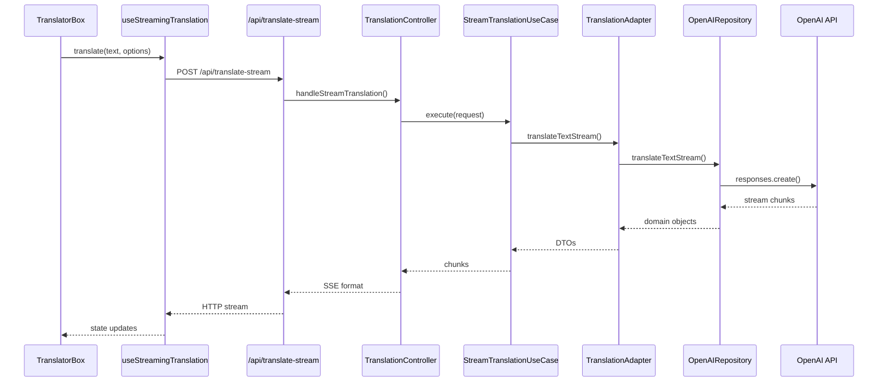

# 🏗️ Clean Architecture - Translation App

## 📋 Структура проекта

Приложение построено по принципам **Clean Architecture** с четким разделением ответственности между слоями.

```
translater/
├── 🎯 domain/                    # Бизнес-логика (ядро)
│   ├── entities/                 # Доменные сущности
│   │   └── translation.ts
│   ├── value-objects/            # Объекты значений
│   │   ├── language.ts
│   │   └── tone.ts
│   ├── repositories/             # Интерфейсы репозиториев
│   │   └── translation-repository.ts
│   └── services/                 # Доменные сервисы
│       └── translation-service.ts
│
├── ⚙️ application/               # Сценарии использования
│   ├── use-cases/               # Use Cases
│   │   ├── translate-text-use-case.ts
│   │   └── stream-translation-use-case.ts
│   ├── dto/                     # Data Transfer Objects
│   │   └── translation-dto.ts
│   └── ports/                   # Порты (интерфейсы)
│       └── translation-port.ts
│
├── 🔌 infrastructure/           # Внешние зависимости
│   ├── ai/                      # AI провайдеры
│   │   └── openai-translation-repository.ts
│   ├── http/                    # HTTP клиенты
│   │   └── openai-client.ts
│   ├── config/                  # Конфигурация
│   │   └── openai-config.ts
│   ├── adapters/                # Адаптеры
│   │   └── translation-adapter.ts
│   └── di/                      # Dependency Injection
│       └── container.ts
│
├── 🔧 interface-adapters/       # Адаптеры интерфейсов
│   └── controllers/             # HTTP контроллеры
│       └── translation-controller.ts
│
├── 🎨 presentation/             # UI слой
│   ├── components/              # React компоненты
│   └── hooks/                   # UI хуки
│       └── useStreamingTranslation.ts
│
├── 📱 app/                      # Next.js App Router
│   ├── api/                     # API маршруты
│   │   └── translate-stream/
│   │       └── route.ts
│   └── (Home)/                  # Страницы
│       └── page.tsx
│
└── 🌍 shared/                   # Общие компоненты
    ├── types/                   # TypeScript типы
    ├── constants/               # Константы
    └── ui/                      # Переиспользуемые UI
```

## 🎯 Принципы архитектуры

### 1. **Dependency Rule**
Зависимости направлены **только внутрь**:
```
Infrastructure → Application → Domain
     ↓              ↓          ↓
Interface Adapters → Domain ←  ✓
     ↓
Presentation
```

### 2. **Инверсия зависимостей**
- Domain слой определяет **интерфейсы** (`ITranslationRepository`)
- Infrastructure слой **реализует** эти интерфейсы (`OpenAITranslationRepository`)

### 3. **Separation of Concerns**
Каждый слой имеет **одну ответственность**:

- **Domain** - бизнес-правила и логика
- **Application** - сценарии использования  
- **Infrastructure** - внешние API и БД
- **Interface Adapters** - преобразование данных
- **Presentation** - UI и пользовательские взаимодействия

## 🔄 Поток данных

### Streaming Translation Flow:


## 🏭 Dependency Injection

Используется простой DI контейнер (`infrastructure/di/container.ts`):

```typescript
// Автоматическое управление зависимостями
const streamUseCase = container.streamTranslationUseCase;
```

## ✅ Преимущества такой архитектуры

1. **Тестируемость** - легко мокать любой слой
2. **Масштабируемость** - добавление новых функций не ломает существующий код
3. **Независимость от фреймворков** - бизнес-логика не привязана к Next.js или React
4. **Гибкость** - легко менять AI провайдера (OpenAI → Claude → Llama)
5. **Читаемость** - четкое разделение ответственности

## 🚀 Как добавить новый AI провайдер

1. Создать `infrastructure/ai/claude-translation-repository.ts`
2. Реализовать интерфейс `ITranslationRepository`
3. Обновить DI контейнер
4. Готово! Бизнес-логика остается неизменной

## 📝 Пример использования

```typescript
// Domain - чистая бизнес-логика
const translation = Translation.create(
  "Hello world",
  "Привет мир", 
  "en",
  "ru",
  "natural"
);

// Application - сценарий использования
const useCase = new StreamTranslationUseCase(adapter, domainService);
const stream = useCase.execute(request);

// Infrastructure - техническая реализация
const repository = new OpenAITranslationRepository(client, service);
const result = await repository.translateText(...);
```

---

**Результат:** Чистая, масштабируемая архитектура с четким разделением ответственности! 🎯